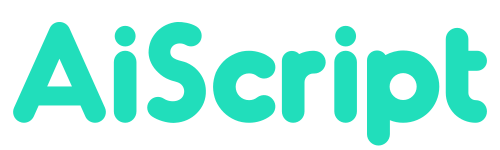

<h1></h1>

[](https://www.npmjs.com/package/@syuilo/aiscript)

[](http://opensource.org/licenses/MIT)
[](http://makeapullrequest.com)

> **AiScript** is a scripting language runing on JavaScript. Not altJS.

AiScriptは、JavaScript上で動作するマルチパラダイムプログラミング言語です。

* 配列、オブジェクト、関数等をファーストクラスでサポート
* 条件分岐やブロックも式として扱えるなどの柔軟さ
* セミコロンやカンマは不要で書きやすい
* セキュアなサンドボックス環境で実行される
* ホストから変数や関数を提供可能

## Getting started
[See here](./docs/get-started.md)

## Example programs
### Hello world
```
<: "Hello, world!"
```

### Fizz Buzz
```
~ (#i, 100) {
  <: ? ((i % 15) = 0) "FizzBuzz"
    .? ((i % 3) = 0) "Fizz"
    .? ((i % 5) = 0) "Buzz"
    . i
}
```

## License
[MIT](LICENSE)
